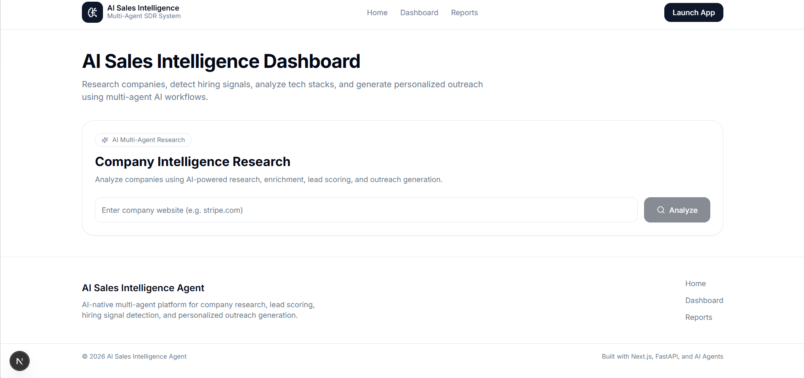
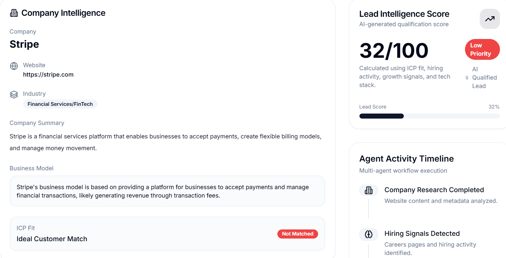

# AI Sales Intelligence Agent

An AI-native multi-agent sales intelligence platform that autonomously researches companies, detects growth signals, scores leads, and generates personalized outreach using LLM-powered reasoning pipelines.

---

# Live Demo

## Web link
https://ai-sales-agent-orcin.vercel.app/

---

# Overview

This project simulates a modern AI SDR (Sales Development Representative) workflow used by AI-native GTM teams and modern SaaS startups.

The platform autonomously:

- Researches companies in real time
- Detects hiring and growth signals
- Analyzes technology stacks
- Scores leads based on ICP fit
- Generates personalized cold outreach
- Produces structured sales intelligence reports

The architecture is inspired by real-world AI sales intelligence systems used in modern startups.

---

# Screenshots

## Dashboard



## AI Sales Intelligence Report



---

# Core Features

## Company Research Agent
- Website analysis
- Business model extraction
- Industry classification
- AI-generated company summarization

## Hiring & Growth Signal Detection
- Job posting analysis
- Expansion signal tracking
- Hiring trend extraction

## Tech Stack Analysis
- Frontend/backend technology detection
- Cloud infrastructure identification
- Analytics tooling detection

## Lead Scoring Engine
Scores leads using:
- ICP alignment
- Hiring velocity
- Growth indicators
- Technology relevance

## AI Outreach Generator
Generates:
- Personalized cold emails
- LinkedIn outreach
- Follow-up sequences
- AI-tailored messaging

## Sales Intelligence Reports
Structured reports including:
- Company overview
- Pain points
- Opportunity analysis
- Outreach strategy
- Lead score
- Growth indicators

## Multi-Agent Orchestration
Agents:
- Research Agent
- Enrichment Agent
- Scoring Agent
- Outreach Agent

---

# Tech Stack

## Frontend
- Next.js 15
- TypeScript
- TailwindCSS
- shadcn/ui
- React Query
- Zustand

## Backend
- FastAPI
- SQLite
- Async Python
- SQLAlchemy
- Pydantic

## AI / LLM
- Groq API
- Llama 3.3 70B
- DeepSeek-R1
- Ollama support

## Scraping & Enrichment
- BeautifulSoup
- Playwright
- RSS feeds
- Job board parsing

## Deployment
- Vercel
- Render

---

# System Architecture

```text
Frontend (Next.js)
        ↓
FastAPI Backend
        ↓
Agent Orchestrator
        ↓
Research Agent
Enrichment Agent
Scoring Agent
Outreach Agent
        ↓
Services Layer
        ↓
Scrapers + LLM Services
        ↓
Structured Intelligence Report
```

---

# Folder Structure

```text
AI-Sales-Agent/
│
├── frontend/              # Next.js frontend
├── backend/               # FastAPI backend
├── docs/
│   └── screenshots/
│
├── README.md
├── .gitignore
└── LICENSE
```

---

# Local Development Setup

## 1. Clone Repository

```bash
git clone https://github.com/gopal092003/AI-Sales-Agent.git

cd AI-Sales-Agent
```

---

# Frontend Setup

```bash
cd frontend

npm install

npm run dev
```

Frontend runs on:

```text
http://localhost:3000
```

---

# Backend Setup

```bash
cd backend

python -m venv venv
```

Activate virtual environment.

## Windows

```bash
venv\Scripts\activate
```

## Mac/Linux

```bash
source venv/bin/activate
```

Install dependencies:

```bash
pip install -r requirements.txt
```

Run backend:

```bash
uvicorn app.main:app --reload
```

Backend runs on:

```text
http://localhost:8000
```

---

# Environment Variables

## Frontend

Create:

```text
frontend/.env.local
```

Example:

```env
NEXT_PUBLIC_API_URL=http://localhost:8000
```

---

## Backend

Create:

```text
backend/.env
```

Example:

```env
APP_NAME=AI Sales Intelligence Agent
DEBUG=True

GROQ_API_KEY=your_groq_api_key

DEFAULT_LLM_MODEL=llama-3.3-70b-versatile
```

---

# API Endpoints

## Health Check

```http
GET /api/health
```

## Company Research

```http
POST /api/research
```

## Outreach Generation

```http
POST /api/outreach
```

## Reports

```http
GET /api/reports
```

---

# Deployment

## Frontend
- Vercel

## Backend
- Render

---

# Future Improvements

- PostgreSQL migration
- CRM integrations
- Email automation
- Multi-company enrichment
- AI memory systems
- Vector search pipelines
- Batch lead processing
- Authentication & team workspaces

---

# License

MIT License

---

# Author

Gopal Gupta
